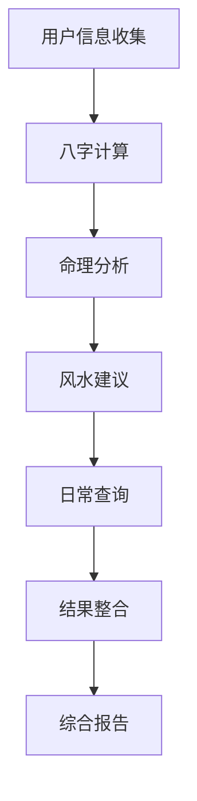

# 🏮 风水命理大师应用

一个结合传统文化与现代技术的风水命理分析应用，提供八字分析、风水指导和每日运势查询功能。

**✨ 最新更新**：
- 🚀 前后端完全集成，实时API调用
- ⚡ 分批加载优化，八字信息秒级显示
- 🎨 丰富的UI展示，充分利用LLM分析结果
- 🔮 沉浸式命理体验，移除技术性提示

## 🌟 项目特色

- **传统文化与现代技术融合** - 运用AI技术解读传统命理文化
- **全栈应用架构** - 后端基于MACore框架，前端采用Next.js
- **完整的业务流程** - 从用户信息收集到综合报告生成
- **美观的用户界面** - 传统中式风格设计，响应式布局
- **模拟演示功能** - 无需API密钥即可体验完整功能

## 🏗️ 项目架构

### 后端 (MACore框架)
```
backend/
├── main.py              # 主程序入口
├── nodes.py             # 核心业务节点
├── flow.py              # 流程定义
├── utils/               # 工具函数库
│   ├── call_llm.py     # LLM调用封装
│   ├── bazi_calculator.py    # 八字计算
│   ├── wuxing_analyzer.py    # 五行分析
│   ├── fengshui_advisor.py   # 风水建议
│   └── calendar_query.py     # 日历查询
└── docs/
    └── design.md        # 设计文档
```

### 前端 (Next.js + React)
```
frontend/
├── src/
│   ├── components/      # 可复用组件
│   ├── pages/          # 页面路由
│   └── styles/         # 样式文件
├── public/             # 静态资源
└── package.json        # 依赖配置
```

## 🚀 快速启动

### 方式一：推荐分别启动

#### 1️⃣ 启动后端API服务
```bash
python3 start_backend.py
```
- ✅ 自动选择可用端口（优先8080）
- ✅ 稳定运行，无重复启动
- ✅ 显示API接口文档

#### 2️⃣ 启动前端服务
```bash
python3 start_frontend.py
```
- ✅ 自动安装依赖
- ✅ 启动在 http://localhost:3000
- ✅ 自动检测后端连接

### 方式二：一键全栈启动
```bash
python3 start_fullstack.py
```
- ✅ 同时启动前后端
- ✅ 自动配置环境变量
- ✅ 适合演示和测试

### 访问应用
打开浏览器访问：http://localhost:3000

### 故障排查
- **端口冲突**：后端会自动在8000-9000范围选择可用端口
- **API连接失败**：确认后端服务正常运行，检查端口匹配
- **依赖问题**：运行 `pip install -r requirements.txt` 和 `cd frontend && npm install`

## 🎯 核心功能

### 1. 八字命理分析 🔮
- **⚡ 分批加载**：基础八字2秒显示，LLM深度分析30-60秒
- **🔥 五行分析**：强度分布、平衡分数、喜用神、过旺缺失元素
- **🌟 性格解读**：AI分析性格特质、优势、注意事项
- **🔮 运势预测**：事业、财运、感情、健康四大运势
- **🍀 幸运指南**：颜色、方位、数字、有益物品、生活贴士

### 2. 风水罗盘功能 🧭
- **数字罗盘**：交互式八方位选择
- **实时分析**：API驱动的方位能量分析
- **个性建议**：基于用户八字的风水指导
- **布局优化**：居住和工作环境建议

### 3. 每日运势查询 📅
- **算法生成**：基于天干地支传统算法，非预置数据
- **今日宜忌**：行事建议、吉时查询、财神方位
- **一致性保证**：同一天结果保持稳定
- **传统融合**：古代历法与现代应用结合

## 🔧 技术特点

### 全栈架构
- **后端**：MACore框架 + Flask API + Python 3.8+
- **前端**：Next.js 14 + React 18 + TypeScript + Tailwind CSS
- **LLM集成**：支持OpenAI、Gemini、DeepSeek等多家提供商
- **数据流**：RESTful API + 分批加载 + 优雅降级

### 核心算法
- **八字计算**：传统天干地支体系，农历转换
- **五行分析**：量化平衡分数，强度分布，喜用神分析
- **风水建议**：基于五行理论的多维环境优化
- **日历查询**：天干地支算法，确保结果一致性

### 用户体验
- **⚡ 性能优化**：分批加载，基础信息2秒显示
- **🎨 沉浸体验**：传统文化氛围，移除技术性术语
- **📱 响应式设计**：移动端和桌面端完美适配
- **🔄 智能回退**：API故障时自动使用本地数据

## 📊 业务流程



## 🎨 设计理念

### 文化传承
- 尊重传统命理文化的核心理念
- 结合现代科学的分析方法
- 提供娱乐性质的文化体验

### 技术创新
- 运用AI技术增强分析能力
- 模块化架构便于功能扩展
- 用户友好的交互设计

### 实用性
- 简化复杂的命理计算过程
- 提供直观易懂的分析结果
- 支持日常生活决策参考

## 🔮 使用场景

### 个人娱乐
- 了解自己的八字特点
- 获取日常生活建议
- 体验传统文化魅力

### 文化学习
- 学习八字五行知识
- 理解风水基本原理
- 感受传统历法文化

### 决策参考
- 重要日期选择
- 居住环境布置
- 颜色搭配建议

## ⚠️ 重要说明

本应用仅供娱乐和文化体验使用，不应作为人生重大决策的唯一依据。请理性对待命理文化，结合现代科学知识做出明智选择。

## 📝 技术栈

### 后端
- **框架**: MACore (自研LLM应用框架)
- **语言**: Python 3.8+
- **LLM**: 支持OpenAI、Gemini、DeepSeek等
- **工具**: YAML解析、农历转换、五行计算

### 前端  
- **框架**: Next.js 14 + React 18
- **语言**: TypeScript
- **样式**: Tailwind CSS 3
- **字体**: Noto Serif SC / Noto Sans SC

## 🚧 开发路线

### 已完成
- ✅ 后端核心功能实现
- ✅ 前端界面设计
- ✅ 基础算法开发
- ✅ 演示模式支持

### 规划中
- 🔄 API接口集成
- 🔄 数据持久化
- 🔄 用户系统
- 🔄 高级分析功能

## 📄 许可证

本项目仅供学习研究使用，请勿用于商业目的。

---

🏮 **传承千年智慧，服务现代生活** 🏮

风水命理大师 - 让传统文化在数字时代焕发新的生命力